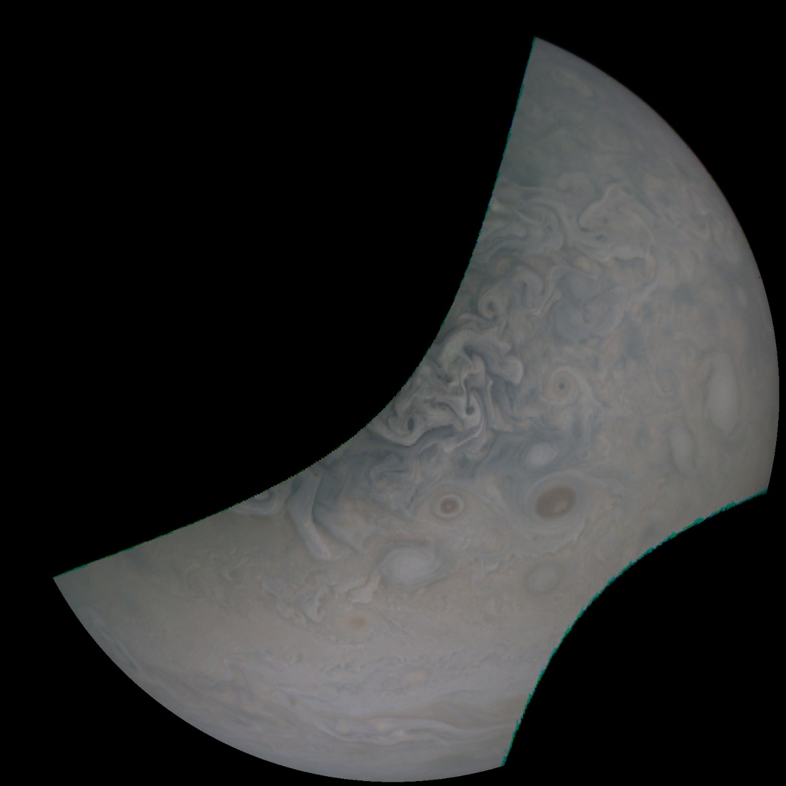
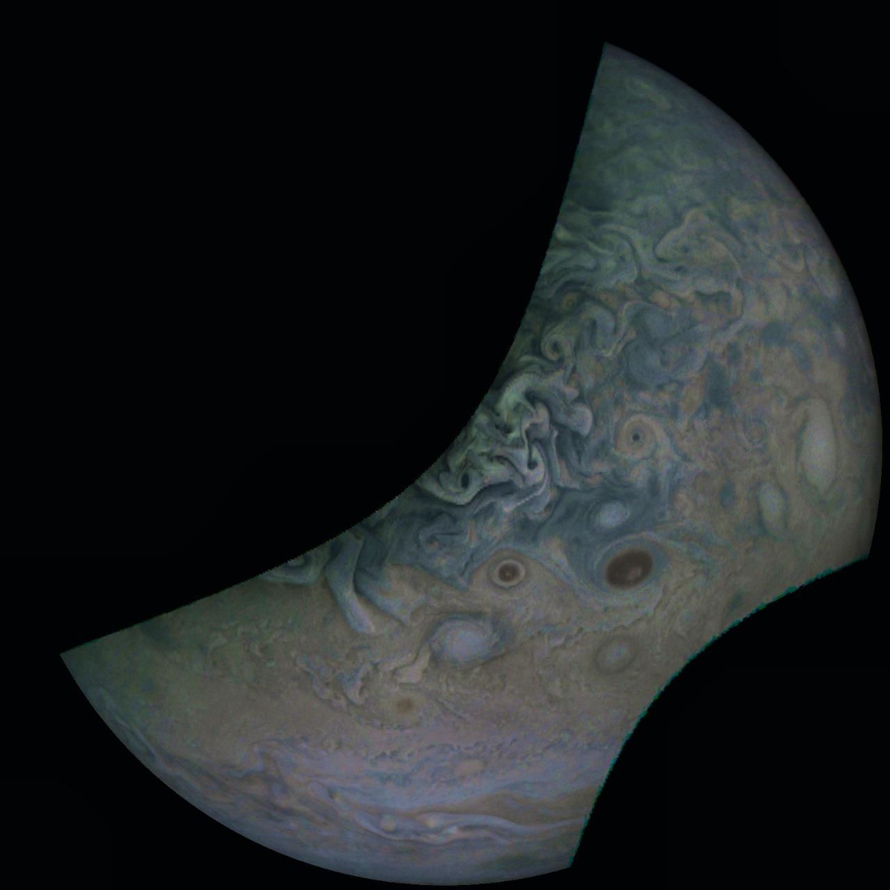

# JUNO Editor

This app was made for [NASA SPACE-APPS CHALLENGE 2022](https://www.spaceappschallenge.org/) for the problem statement [Visualising the Jovian System](https://2022.spaceappschallenge.org/challenges/2022-challenges/jovian-system/details). 

JUNO Editor is Python GUI program for modifying and enhancing the satellite images from the JUNO mission for producing images with more details, color balancing etc for understanding the image better. It can accept the images as different grey-scale images for each channels or as a combined color image. 

The functionalities of the application are:
- Auto-Enhancing
- Color Balancing
- Changing the Contrast
- Changing the Brightness
- Changing the Sharpness

## Installation

1. Clone Repository and open terminal in the repository folder
2. Create a virtual environment using `python -m venv venv`
3. Activate the virtual environment using `source venv/bin/activate`
4. Install the requirements using `pip install -r requirements.txt`
5. Run the application using `python main.py` or `python3 main.py`

## Usage

1. Open the application using `python main.py` or `python3 main.py`
2. You have option to either Upload one RGB image or three different grey-scale images for each channel. Select the reuired option and upload the image(s).
3. You can see the image in the application. You can change the contrast, brightness, sharpness and color balance of the image using the sliders or use the auto-enhancer to get better results and modify that.
4. You can save the image using the save button.

## Example

